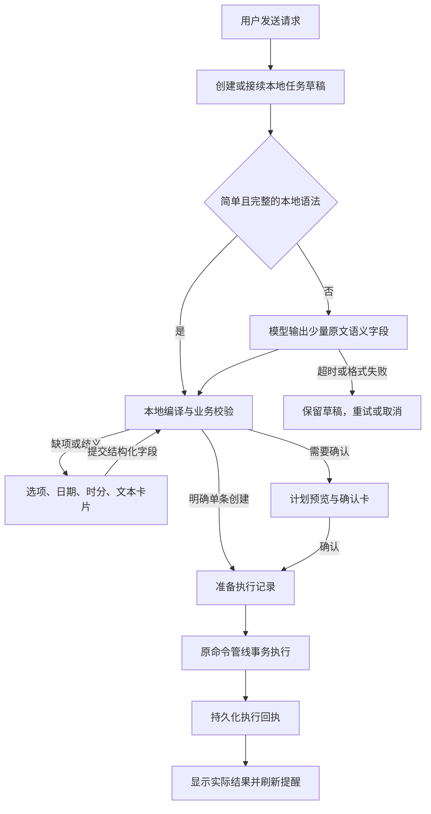

# AI 任务草稿框架与交互式问答

日期：2026-09-20

状态：已修改待测试

适用：当前 WPF 正式应用的快问与完整对话。Vue/Tauri 实验目录不在本次范围内。

## 需求与变更原因

原路径需要模型先生成会话计划，再为每个操作生成完整强类型参数。参数格式不合规会直接结束为 argument_invalid；补充信息主要依赖用户继续输入文字，快问每次发送又会创建会话，难以稳定接续任务。

新要求是让任务在本地持续存在，模型负责理解原话，本地负责时间、候选、缺项、确认与执行。用户通过选项和表单补充，已有任务内容不因一次格式错误而丢失。

这次改变的是任务交互及编排入口。既有命令合同、SQLite 写队列、目标版本校验、事务回滚和提醒投递机制继续复用。

## 运行路径

普通聊天保留原有流式回复和停止功能。查询读取本地数据，查询范围不明确时展示范围选项；不会让模型编造本地事项。

## 模块及职责

| 模块 | 职责 |
| --- | --- |
| AssistantDraftInterpreter | 一次理解生成 version 3 草稿；验证版本、字段、操作白名单和原文证据；至多一次格式修复 |
| AssistantDraftCompiler | 确定性时间解析、周期规则、缺项字段、旧命令对象构造；不访问模型 |
| AssistantDraftStore | SQLite 保存草稿、状态、版本、候选快照、固定参考时间与时区 |
| AssistantDraftRuntime | 会话状态流转、卡片操作、执行回执恢复、失败处理 |
| AssistantPlanPipeline | 沿用已有执行策略、目标版本/hash、确认、短事务及整体回滚 |
| AssistantTaskCard / AssistantInputViewModel | 快问与完整对话共享卡片；结构化提交，不从展示文本反向解析 |

App 启动注入 AssistantDraftInterpreter 后，新普通请求进入 V3。保留 V2 构造与入口供历史会话、法定节假日特殊流程及既有兼容测试使用。不能把所有 V2 单测视为新入口覆盖，V3 另有端到端测试。

## 草稿与状态

每份草稿保存 requestId、sessionId、revision、原始请求、固定 referenceTime、IANA timeZone、tasks、fields、候选与已选绑定、confirmationId、结果。

主要状态：

- Understanding：理解或本地重新编译。
- NeedsInput：等待用户通过卡片补充。
- Prepared：已确定执行标识；恢复时先查回执。
- NeedsConfirmation：等待确认。
- Succeeded、Cancelled、Expired、Superseded：终态。
- Failed、Interrupted：保留任务供修改或重试。

每次更新比较 revision。旧卡、跨会话请求、伪造候选均不能提交。草稿有效期 15 分钟；不是无限期排队任务。已提交信息可在会话切换或重启后恢复；尚未提交的编辑控件值不跨重启保存。

一次请求至多 5 个任务，其中写操作至多 3 个。多写计划先补齐全部字段，再整体确认执行。新问答按钮明确创建新会话；普通快问发送接续当前会话。

## 交互规则

| 场景 | UI |
| --- | --- |
| 提醒时间缺失 | 日期选择器 + 24 小时制小时/分钟选项 |
| 每日或每周任务缺时间 | 小时/分钟选项 |
| 同名事项多个候选 | 显示名称、类型、时间的候选下拉框 |
| 查询时间范围不明 | 今天、明天、后天、本周、下周、本月选项 |
| 标题等自由文本缺失 | 对应字段文本框 |
| 修改、删除或多步骤计划 | 预览 + 确认执行 / 修改信息 / 取消任务 |
| 超时或中断 | 保留任务 + 重试 / 取消；已有字段可修改 |
| 旧版候选或时间建议 | 适配为选项卡；旧版未知补充字段使用表单文本框 |

V3 选择候选和填写时间直接更新本地草稿，不再次调用模型猜测用户选了什么。旧版缺项会话仍通过原解析器兼容续接。

修改确认卡会废弃旧计划并生成新版本。任务执行期间禁用按钮。切换会话取消旧请求；旧请求完成后只保存到所属会话，不覆盖当前会话界面。

## 时间和重复提醒

- 原始时间文本由模型摘录，日期计算使用本地固定参考时间。
- 凌晨 12 点解析为 00:00；未注明时段的“12 点”要求用户明确选择。
- 支持常见数字/中文时间、相对分钟/小时/天、今天/明天/后天、周几和完整日期。
- 日程只有结束时刻而无日期时，结束日期继承已明确的开始日期；结束不晚于开始时要求补充。
- 同一提醒时间被模型重复放入 timeText 和 reminderText 时，本地仅在文本相同或解析时间相同的情况下合并；不同时间要求用户选择。
- 每日、周一至周五、指定每周日期提醒进入现有实际调度表。canonical 规则与旧表投影在同一事务写入，避免显示成功但未调度。
- 周期提醒保存首次生效日期，未来开始的提醒不能提前触发。修改时间、完成、删除同步更新调度投影。

当前 V3 普通卡片仅支持每日/每周提醒的可执行周期。每月、周期待办/日程/长期事项以及复杂截止/间隔规则不自动近似为另一条规则；会提示选择支持的方式或取消。原有法定工作日/节假日睡眠方案继续走已接入的特殊流程。

## 执行与故障边界

- requestId + revision 生成稳定计划标识，准备记录和已提交回执均可查询。
- 确认时重新校验目标版本。用户在其他入口改动事项后，旧确认不会覆盖新内容。
- 多写任一步失败，沿用原事务回滚。
- 成功文案仅在事务回执成功后生成；模型不能直接宣布本地写入成功。
- 提交完成但 UI 来不及保存状态时，通过回执恢复，不重新创建。
- 网络请求至多重试一次，仅针对网络异常、429、5xx；认证与请求配置错误不反复重试。
- 单次非流式模型请求 60 秒预算，V3 理解轮次 90 秒总预算；支持取消。
- 格式修复保留原消息与参考上下文，最多一次。空响应、拒绝、截断、未知字段和重复 JSON 属性均不进入执行。
- 已保存事项但调度刷新失败时明确告知“已保存、刷新失败”，避免诱导重复创建。

单机进程内按服务顺序处理草稿，SQLite 版本比较和原执行回执提供重放保护。这里没有新增分布式服务、消息队列或后台代理。

## 验证与验收

新增测试覆盖任务缺项、选择候选、跨会话拒绝、旧卡失效、取消、重启恢复、提交后恢复、重复点击、多步骤、真实周期投递、未来生效时间、周期修改和删除、旧卡续接、普通聊天流式输出。

真实模型测试使用现有配置与 15 条公开合成请求，绕过本地快捷解析，检查理解结果；不写业务数据库。最近一轮通过。它是小样本验收，不代表所有自然语言都正确，仍保留失败、补充和确认路径。

界面测试使用实际 WPF 控件，在 340 / 560 DIP、深色 / 浅色主题下渲染四种卡片，共 16 组；检验选择绑定、时分绑定、按钮和高度约束。

人工验收建议：

1. “每天的凌晨12点提醒我睡觉”：出现正确的每日 00:00 提醒，检查事项工作台与后续实际通知。
2. “提醒我喝水”：直接选择日期和时分后继续；重复点击不会产生两条提醒。
3. 存在两个同名事项时发起修改：从选项选择目标，核对并确认。
4. 同时创建待办和缺少时间的提醒：已有字段保留，补齐后整体确认。
5. 在确认卡点修改，再尝试旧操作：旧确认不可执行。
6. 在补充阶段重启并选择原会话：可恢复待补充任务。
7. 中断模型网络或停止生成：可继续处理保留的任务。
8. 在实际显示器与缩放比例下检查弹出日历、下拉框、滚动区域及键盘操作。

自动化检查不能替代上述桌面人工验收。当前状态为“已修改待测试”。
