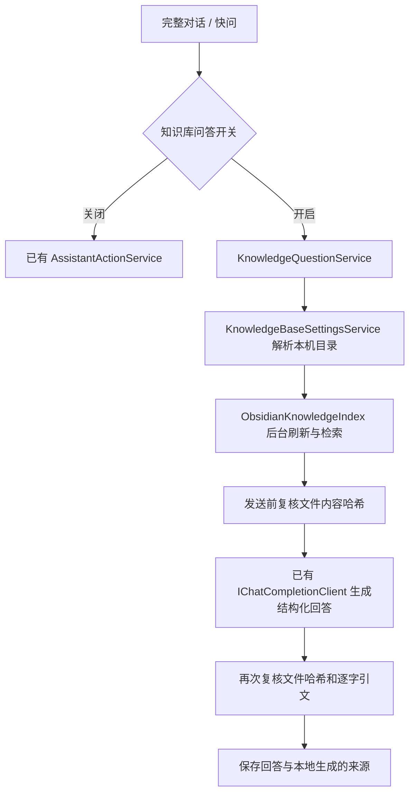

# Obsidian 本地知识库问答

日期：2026-10-02。状态：已修改待测试。适用当前 WPF 应用。

## 使用与成功标准

1. 在设置的 AI 模型区域配置兼容 Chat Completions、支持 JSON 输出的模型服务。
2. 知识库目录留空时，读取 `%APPDATA%\obsidian\obsidian.json`：优先唯一标记为打开的库，否则仅在登记库唯一时选用。多个候选要求手动选择，不猜测。可选整个库或一个实际资料子目录，不需要安装 Obsidian 插件。
3. 在完整对话或快问勾选“知识库问答”，输入完整问题，注明项目、版本和原文关键词。两处共享开关；开关仅在本次应用运行中保持，重启默认关闭。当前每题独立检索，不将前轮回答当作事实，也不自动解释“它”“继续”等省略问题。
4. 每次提问自动刷新本地 Markdown，再用命中的原文回答。模型先理解问题，按结论、步骤、代码示例和注意事项组织 Markdown；逐字核对证据后，每段附可点击的来源编号，文末集中列出文档与行号、修改时间，不再逐段重复粘贴引文。完整对话与快问均可选中复制。
5. 未命中、依据不足、目录不可用、文件变化、模型错误和引用错误必须明确显示，不回退为模型自由发挥。已有任务确认、普通聊天与停止功能继续保留。

## 调用链及职责

- `KnowledgeBaseSettingsService` 单独保存目录，采用临时文件替换，损坏设置要求修复；断开的已保存目录不会阻止保存其他应用设置。自动识别依据已核对的本机 Obsidian 登记格式，此格式将来变化时可手动选目录。
- `ObsidianKnowledgeIndex` 为进程内单例，使用信号量串行保护缓存，在后台线程执行。每题枚举实际文件，根据长度、修改时间复用未变内容，变化时重新读取并按标题、行号分段；删除、读取失败或超大的笔记从新快照移除。
- 检索使用中文相邻双字词、英文/代码词及版本号，加上标题和相对路径，按 BM25 形式的词频/逆文档频率排序，每份笔记最多选 2 段，总计最多 6 段。没有向量服务、嵌入模型、后台常驻扫描或额外数据库迁移。
- 每次模型请求前后，重新读取入选文件并比较规范化文本 SHA256；发生变化或不可读时丢弃回答，同时失效对应缓存，下一题重新读取，包括“长度和时间戳不变、内容改变”的情况。
- `KnowledgeQuestionService` 只持有设置、索引和模型接口，不访问命令执行管线。提示将所有笔记正文、标题和元数据视为参考数据，要求区分版本、历史状态、冲突和缺失依据。
- 回答只接受有限结构的 JSON。检查字段与重复字段、要点数量、来源编号和对应原文的连续精确摘录。任何一点校验失败都不展示模型结论，只显示本地检索摘录；不做无限格式修复，也不流式展示未核对结论。
- `LifeViewModel.Send` 按显式开关分流，仍沿用会话存储、正在处理状态、停止及会话切换取消。知识库回答不清除原有任务卡片或待确认计划。
- 知识库消息以既有正文前缀识别，使用随主题变化、只读且可选中的正文控件；历史会话可继续显示来源，不需要改表。普通消息保留已有 Markdown 展示。

## 资源与异常边界

| 项目 | 当前限制或处理 |
| --- | --- |
| 扫描范围 | 本机实际目录中的 `.md`；不跟随符号链接、目录联接；跳过点号目录/文件、隐藏/系统项、node_modules |
| 单文件 | 最多 2 MiB；读取时再次限制字符数并检查文件是否变化；超大、读取失败或无效 UTF-8 文件跳过并计数 |
| 总索引 | 最多 20,000 笔记、20,000 文本段、16 Mi 字符；最多遍历 100,000 目录项；达到上限明确提示检索不完整 |
| 分段 | 约 1,800 字符；超长单行继续分段并保留真实行号；标题最多 200 字符，元数据最多 1,000 字符 |
| 模型输入 | 完整问题最多 2,000 字符；至多 6 段原文，附相对路径、标题、行号及前置元数据；不发送整个库 |
| 回答校验 | 响应最多 20,000 字符、JSON 深度 12、6 个要点，每点 1–3 条证据，连续引文 6–500 字符 |
| 超时与停止 | 整轮预算 90 秒并传递取消；复用现有模型服务的 60 秒请求预算及有限网络重试 |
| 降级 | 明确报错或只显示检索原文；不使用旧快照替代失败读取，不回退普通聊天或任务创建 |

初次提问需建立内存索引，重启后再次建立。实际测试中，本机 748 篇可用笔记首次约 6.3 秒、缓存后的同题检索约 0.1 秒；这是该机器该样本的观测，不是性能承诺。

## 可信度与隐私边界

逐字引文验证只能证明引用来自文件，不能数学证明模型归纳正确或笔记本身正确。回答明确标为 AI 归纳，需结合版本、环境、历史状态和原文上下文核实；不把“已修改待测试”提升为“已解决”。词法检索可能漏掉仅靠同义表达才能找到的资料；未命中不表示库中不存在该知识，可补充关键词或缩小目录。

问答索引不解析 PDF、图片、附件、Canvas，不展开双向链接/嵌入的目标文件；被链接的 Markdown 若在选定目录内，会作为独立笔记参加检索。没有跨轮语义记忆和语义向量检索。查看器可以显示图片，但不把图片识别为问答证据。

扫描、缓存和哈希复核只在本机发生，笔记不被修改。提问与命中片段、相对路径及元数据会发往用户已有模型服务；源文件的绝对路径仅用于本地回答展示。既有会话数据库会保存回答和引用。界面与 README 已说明这些行为。

Obsidian 将笔记保存为库目录中的 Markdown 文件，库内 `.obsidian` 为配置目录、Windows 全局配置目录为 `%APPDATA%\Obsidian`，参见 [Obsidian 官方数据存储说明](https://help.obsidian.md/Files+and+folders/How+Obsidian+stores+data)。自动识别的登记 JSON 结构另经本机文件核对，保留手动路径作为稳定入口。

## 验证与人工验收

自动化覆盖目录识别/歧义、损坏设置、离线目录、中文与代码检索、更新/删除/改名、占用与超大文件、隐藏目录、无效编码、并发与取消、超长标题、来源哈希变化、伪造编号/引文、结构错误、无依据回答和待确认任务保留。

已做真实模型的 5 个公开合成场景：有据问答、版本区分、待测试状态、笔记指令干扰、缺失性能指标。真实本机知识库仅做只读检索与哈希校验，没有发送其原文给模型。界面使用真实完整对话窗口、设置区域和快问开关，在深浅主题/两种宽度下检查绑定、禁用、文字颜色及选择复制。

人工验收：

1. 在设置中检查自动识别的目录；分别选择整个库和子目录，保存后提问已知问题并打开原文件核对引文和行号。
2. 测试实际业务的项目、版本、历史规则冲突与多文档问题，确认答案没有把未验证信息当事实；用完全不相关的问题检查资料不足提示。
3. 修改/改名/删除笔记后再问，检查刷新；暂停磁盘或目录访问，检查提示并确认普通聊天仍可使用。
4. 在快问和完整对话间切换模式、停止请求和切换会话；确认不会创建事项，也不会丢失原有待确认任务。
5. 在真实屏幕 DPI 与主题下检查长回答滚动、文本复制和来源路径；重启确认设置保留、模式默认关闭。

当前状态仍为“已修改待测试”，待用户明确反馈人工验收结果后更新原 Debug 记录。

## Markdown 查看与来源跳转（2026-10-02 反馈更新）

- 主窗口侧栏“Markdown 查看器”打开独立窗口，可选择本地 `.md` / `.markdown`，切换阅读排版与只读原文。点击回答的 S 编号或来源文档会在查看器打开并定位到引用行所在内容块；点击普通 HTTP/HTTPS 网页使用默认浏览器，直接 `.md` URL 在查看器读取。
- 旧记录的 `[S#] 绝对路径 · 第…行` 在显示时转换成来源链接，不改写数据库。旧回答不会自动重发模型；新的组织方式作用于重新提问后的回答。
- 解析使用 [Markdig 1.4.0](https://github.com/xoofx/markdig)，BSD-2-Clause，许可证随发布包放在 `ThirdPartyNotices/Markdig.txt`。参考 [MdXaml](https://github.com/whistyun/MdXaml) 的原生 FlowDocument 展示方式；没有复制其源码，也没有引入 WebView 或加载外来 XAML。
- 标题、列表、代码、粗体、引用块、表格和链接转换成原生 WPF 元素。聊天列表使用像素滚动；只读 Markdown 控件向外层转发滚轮，可查看超出一屏的单条长回答。沿用原最大化工作区限制。
- 本地文档按 UTF-8 读取，单文档上限 2 MiB；网络原始 Markdown 请求有 20 秒超时，同样有流式大小限制。网络失败、文件丢失/权限/编码问题显示在窗口内；新文档失败保留上一份可读内容。关闭窗口或选择下一文件取消旧请求。
- Markdown 不执行 HTML、脚本或代码。打开的文档内支持标准图片和 `![[明确图片路径]]`，按可用宽度显示预览，点击在独立同主题窗口查看，支持适应窗口、原始大小与缩放。中文、空格、编码的 `#`/`%` 和上级附件目录按来源文档解析；切换到内容相同但目录不同的笔记，也重新解析图片来源。聊天没有来源文档时，图片保持可点击链接。
- 图片支持 PNG、JPEG、GIF、BMP、TIFF、ICO（多帧文件显示第一帧）；可以读取本地附件或 HTTP/HTTPS 图片。后台异步读取与解码，最多 4 个并发读取；单图 16 MiB、3200 万像素，预览最长边 1200 像素，每篇最多自动预览 32 张，余下保留点击入口。窗口关闭或内容替换取消待完成读取；缺失、损坏、超限、网络失败明确显示，不锁住源文件、不写入附件。
- 链接仍禁止 UNC、可执行文件与任意协议；网络文档不能读取本地图片。Obsidian 双链支持相对当前文件的明确路径，不搜索全库猜测同名附件，不展开 Markdown 文档嵌入。不支持 SVG/WebP、PDF 预览或 Mermaid 图形渲染。图片读取不调用模型服务。
- 源文档显示的是当前磁盘内容，不是历史引用快照。原文更新时间保留在回答中；逐字核对依然不等于自动证明模型归纳正确。
- 本轮真实模型检查增加代码示例场景，共 6 个公开合成场景；实际业务文档没有为测试上传模型。
