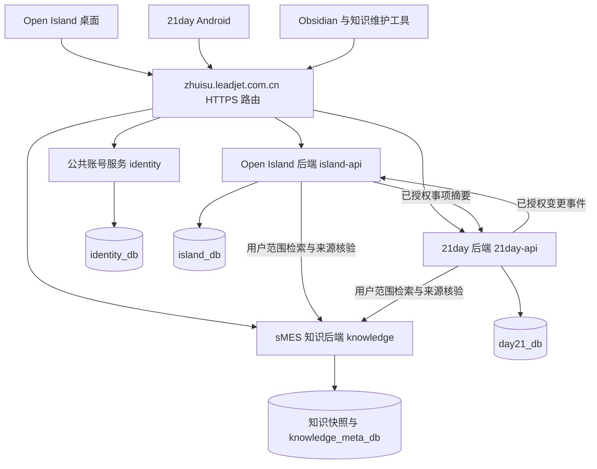

# Open Island、21day、sMES 知识库三端互通规划

版本：实施修订 v1.1 · 日期：2026-10-05（Asia/Shanghai） · 状态：**已修改待测试（首批代码完成，完整互通仍在实施）**。

目标是让一个用户在 Open Island 管理桌面事项、在 21day 管理习惯与作息，并在两端使用获授权的 sMES 知识；登录后恢复各项目的全部可迁移用户数据、设置和个性化界面，历史报表能汇总事项与打卡。三个项目统一使用 `https://zhuisu.leadjet.com.cn`，代码、业务规则、数据库、权限和发布分别管理，通过明确的接口互通。

2026-10-04先按用户选择编写三项目规划；随后用户要求“按照规划执行”“继续”，已进入实施。2026-10-05确认邮箱与密码登录。原纯规划记录保留，当前首批实现和未完成项见第18节；测试通过不等同用户人工验收或全部阶段完成。

## 1. 已确认要求与方案边界

| 要求 | 规划中的对应结果 |
| --- | --- |
| 汇总所有事项的历史记录 | Open Island 新增历史中心：汇总、明细表、统计图、周期报表和导出；能区分 Open Island 与 21day 来源 |
| 邮箱登录 | 独立账号服务提供邮箱验证注册、密码登录/重置和设备会话；每项目独立校验权限 |
| 登录同步全部数据和设置，包括界面设计 | 业务数据、聊天、历史报表、个性化设置、设计参数和用户资源均纳入清单；设备专属状态有明确恢复方式 |
| 21day 打卡进入灵动岛 | 展示带来源的 21day 事项；在灵动岛操作时调用 21day 规则和接口，再把结果同步到手机 |
| 三端区别清楚、数据互通 | 每个实体只有一个归属项目；其他项目保存引用或可重建的展示副本，不建立第二份可独立修改的主数据 |
| 三个后端共用指定域名 | 三个独立路径、独立服务、独立数据库账号；保留现有网站及 `/knowledge/` 接口 |
| 后续自动推送更新 | 分别定义 Git/Windows 发布、Android APK 发布、知识快照发布及服务部署流程，不用同一个发布器覆盖三项目 |

“sMES 知识库”指现有资料、来源、附件、版本目录与知识维护流程。本轮不把 sMES 生产业务数据库、ERP 工单或企业工作台账号视为已经接通的数据源。个人打卡可关联知识，不能自动变成 MES 业务单据。

## 2. 现状核对与证据边界

| 项目 | 已核实的基础 | 缺口与保留要求 |
| --- | --- | --- |
| Open Island / 时屿 / ChronoIsle | 原规划工作树 `75f7f47`；实施基线为 `5091d37` 加已部署事项修正，WPF；`life-assistant.db` SQLite、事项领域模型、归档、聊天、JSON 设置；`ReportService` 已有日/周/月报快照 | 不是从零增加周报。缺账号、跨设备全量同步、21day 接入及完整历史中心；不能把最新部署能力误写成当前分支已包含 |
| Open Island 后续知识版本 | 本地 Git 对象 `5091d37` 包含知识服务、远程客户端与部署文档；Debug 记录已部署知识查询 | 该提交与当前工作树不同。实施前选择包含最新知识和事项修正的基线，不能拿旧分支覆盖现用程序 |
| 21day / 廿一 | `E:/21day`，Kotlin + Compose；当前配置 0.10.1 / code 16；SharedPreferences 保存作息、习惯、聊天、报告和设置 | 未在本次源码与部署资料中发现自有账号后端；联网 AI 和 GitHub 更新不等于已有用户同步后端 |
| sMES 知识库 | 远程 `/knowledge/` 可读，固定快照检索、来源/哈希核验；Obsidian 为编辑源，按需发布 | 当前查询服务不是 MES 业务系统。检索最多 6 段，无项目/版本硬过滤；尚无面向个人账号的文档 ACL |

已读取的项目规范：21day 的 `AGENTS.md → Agent.MD`；Open Island 另一工作树 `88a0` 的项目 `AGENTS.md`（修改后构建必要产物并重启、验证新进程）；全局 AGENTS；sMES 项目 README、远程项目/7.0 入口、流程索引、维护规范及平台简介。当前 Open Island 工作树和 `D:/sMES` 根目录没有独立项目 Agent 文件，不声称已读到不存在的文件。

sMES 证据快照为 `097f8f3be35a438c8c019413c69b6beb`。7.0 归属仅适用于既有导入资料；平台简介记载低代码平台、智能工作台、分布式集中管理平台，这是资料陈述，不代表已接入这些运行系统。未获得完整 MES 运行架构与业务代码，本规划只设计知识服务互通。

## 3. 项目职责、服务入口与数据归属

以下新路径、服务名和库名均为拟定，不代表已部署。

| 项目或公共能力 | 对外入口 | 独立持久化 | 唯一职责 |
| --- | --- | --- | --- |
| Open Island 后端 | `/island-api/v1/` | `island_db`，角色 `island_app`；独立附件目录 | 桌面事项、日历、提醒、桌面设置/外观、桌面聊天、历史中心及外部事项展示副本 |
| 21day 后端 | `/21day-api/v1/` | `day21_db`，角色 `day21_app`；独立附件目录 | 习惯、21天周期、作息、规则历史、打卡/计次/计时、手机设置/外观、手机聊天与复盘 |
| sMES 知识后端 | 保留 `/knowledge/v1/`；扩展 `/knowledge/v2/` | 原知识快照卷；新增 `knowledge_meta_db`，角色 `knowledge_app` | 版本化文档、检索、来源、授权、收藏/批注和知识关联；原文仍由知识维护流程发布 |
| 公共账号服务 | `/identity/v1/` | `identity_db`，角色 `identity_app` | 平台用户 ID、已验证邮箱、设备、会话、项目接入授权；不保存三项目的事项或设计配置 |

首期可共用一个 PostgreSQL 实例，但数据库与应用账号分离，撤销跨库访问与不必要的默认权限。运维管理员有管理能力，不意味着业务服务可互查其他库。公共账号服务为基础设施，不把三个业务项目合并成一个产品。

原 `/knowledge/v1/` 继续兼容既有项目密钥，逐步限定为受信服务/维护工具使用。新客户端走支持用户和版本权限的 v2。知识写入凭据始终不下发给普通桌面或手机客户端。

### 3.1 互通矩阵

| 数据 | 归属项目 | 其他项目的使用方式 |
| --- | --- | --- |
| 21day 习惯、目标、规则、打卡 | 21day | Open Island 展示引用、调用 21day 命令；不能改本地副本后反向覆盖手机 |
| Open Island 待办、日历、提醒 | Open Island | 21day 可在独立“关联事项”区域显示摘要/调用对应接口；不能自动改成21天习惯 |
| 两端聊天和原生报告 | 各自来源项目 | 登录恢复原项目历史；汇总入口按来源展示，不合并成一条失去上下文的聊天 |
| sMES 原文及附件 | sMES 知识库 | 两应用通过授权引用、检索、阅读；默认只缓存需要的内容 |
| 事项与知识的关联 | 事项归属项目保存引用；知识项目保存授权范围内反向索引 | 关联标识携带项目、事项ID、知识路径/文档ID及快照；权限核对后展示 |
| 主题、卡片、布局、动效 | 各自来源项目 | 同项目跨设备恢复；Windows 和 Android 的设计配置分别保存，不互相覆盖 |

外部实体标识固定为 `(source_project, source_entity_type, source_id)`，展示副本额外保存 `source_revision`、`last_synced_at` 和可执行动作。名称相同不表示同一个事项；服务端决定来源，客户端不能通过修改来源字段“搬家”。

## 4. 邮箱登录与独立权限

### 4.1 已确认的需求变更

用户于2026-10-05明确将微信接入改为“邮箱 + 密码，注册时验证邮箱”，不再准备微信应用审核。原微信方案保留在2026-10-04规划历史；本修订采用邮箱身份，稳定user_id、项目数据归属与知识独立授权继续保留。

用户账号采用各自的邮箱与密码；用户已确认使用个人163邮箱 t2534407460@163.com 仅发送注册/重置验证码，不创建公共邮箱，也不将该邮箱作为所有人共用的登录身份。发件服务器固定 smtp.163.com:465/TLS，凭据仅在账号服务的受限挂载文件中配置。用户已通过服务器交互脚本配置SMTP客户端授权码，认证与NOOP250成功，mailReady=true；此前一次普通密码认证失败保留在Debug。尚待用户实际收信/注册反馈，验证探针未发邮件。网页邮箱密码与应用账号密码、SMTP授权码分别管理，均不写入源码或聊天记录文档。

### 4.2 注册、密码与会话流程

1. 客户端提交邮箱、密码、客户端ID与设备ID到固定HTTPS身份入口。邮箱标准化且唯一，注册/重置密码9至128字符，包含字母、数字及标点/符号（空白不算符号）；旧已注册密码登录继续按原hash验证；PBKDF2-SHA256使用独立随机盐和600000次迭代，服务端不保存明文。
2. 注册生成6位验证码，10分钟内有效，最多5次验证尝试；服务端保存绑定邮箱、用途和挑战ID的HMAC摘要。未验证不创建可登录用户；发信失败使挑战失效。60秒内不重复发送，同一邮箱每天最多10次。
3. 验证通过后事务创建稳定user_id与设备会话；两客户端使用相同邮箱对应相同身份。密码重置须证明邮箱，成功后撤销全部旧会话。
4. 访问令牌RS256签名、15分钟有效；刷新会话30天，摘要存储、每次轮换，旧刷新令牌重放撤销整条会话。登录失败5次暂时锁定15分钟，不透露邮箱是否存在。
5. 业务服务检查签名、issuer、audience、scope、用户ID，并在线核验会话是否撤销。身份服务不可用时不接受云端写入，本地业务仍保留。当前仅签发island和21day范围，未授予knowledge权限。
6. Windows使用DPAPI当前用户保护会话；Android使用Keystore和noBackup目录。退出不删除业务数据；首次绑定的数据归属凭据继续保存，阻止账号A数据被误上传到账号B。令牌不进URL、日志、报表或普通同步包。

知识ACL与邮箱验证分开。注册成功不授予MES原文、维护权限或生产系统权限；知识检索、原文、图片、导出、缓存与来源跳转必须在同一用户/版本/路径范围内鉴权。

### 4.3 首次绑定与账号切换

完整同步上线前须实现本机数据预检、迁移确认、云端逐项合并与账号隔离库。当前客户端只保存本地数据集的账号归属并拒绝换号串数据，尚未实现多个账号的独立数据目录或全量同步；这不是账号迁移完成声明。

## 5. 全量同步清单与界面设计恢复

“全量”要求先枚举现有持久化来源，逐项登记处理结果，不能只同步 Todo 表就宣称完成。每个项目维护带版本的同步清单：`entity_type / source / scope / sensitivity / migration / supported_since / verification`。新增设置时必须同时给出其同步或本机恢复策略。

| 类别 | 需要保存/同步的内容 | 恢复和应用规则 |
| --- | --- | --- |
| Open Island 业务 | 全类型事项、层级、日历、时间语义、周期/例外、优先级、归档/删除、完成与延期历史、草稿、聊天、用户保留的报告与审计记录 | 保留原ID映射和语义；草稿恢复为待确认，不恢复后自动执行 |
| 21day 业务 | 作息计划/待生效规则、日记录/问答/验证结果、习惯轮次、历史目标、日总量、时段/余秒、运行计时、事件记录、聊天、事实快照/AI报告 | 分别按作息与习惯规则恢复；同步记录不触发锁屏、验证完成或重复计费 |
| 常规设置 | 语言、提示、声音、勿扰、复盘开关、模型地址/模型名、筛选、排序、偏好 | 每个项目独立命名空间；公共账号资料只用于身份，不强制统一应用偏好 |
| 界面设计 | 主题、强调色、透明度/材质选择、字体/字号、模块开关与顺序、卡片尺寸、显示密度、动画偏好、吉祥物/背景等用户资源、报表布局 | 结构化参数加资源清单；源码中固定的界面属于应用版本，不把 WPF XAML 或 Compose 可执行代码作为用户配置下发 |
| 设备配置 | 灵动岛位置/显示器偏好、快捷键、自启意图；手机小部件选择、验证点配置、权限需求 | 云端保留按设备分类的配置；屏幕ID/Widget ID重新映射，位置按比例并限制在可见区；系统权限必须本机授权 |
| 敏感用户配置 | 用户模型 API Key、受保护验证点与相关私密参数 | 单独加密保险库/受控迁移通道；不复制 DPAPI/Keystore 密文字节当作跨设备可解密数据；旧明文 JSON 备份格式保持原边界 |
| 附件与用户素材 | 消息/事项附件、用户背景、图标、报告文件、关联资源 | 资源ID、MIME、大小、SHA-256、归属和权限；上传完成验哈希后再提交引用，支持续传 |
| sMES 知识 | 授权的原文、附件、元数据、快照、版本、收藏、批注、关联、阅读偏好 | 原文仍在知识项目；个人同步保存引用和个人元数据。需要离线资料时由知识项目提供授权包，不复制整库到每个用户账号 |

各项目设置键采用 `project_id + scope + key`。作用域为账号内项目级、平台级、设备级；应用优先级为设备覆盖 > 平台覆盖 > 项目默认 > 应用默认。界面恢复兼容版本不支持的字段时保留原值并显示未应用原因，旧客户端不得回写删除未知字段。

敏感配置推荐使用服务端信封加密：每账号/项目数据密钥，主密钥从宿主受保护文件挂载、独立备份，不进入普通数据库备份或镜像。新设备恢复需要重新验证登录。此方案服务器可解密，文档和产品说明不能称为端到端加密；后续若要求服务器不可读，需要另设恢复密钥方案，不能两种承诺混用。第三方 OAuth 会话、操作系统授权、正在运行的进程句柄、系统通知监听凭据需要重新授权或重建。

“无法原样执行”不等于静默丢弃数据。同步清单必须返回：已同步、设备专属已保存、需本机重新授权、可重建、不在用户数据范围。内存缓存、临时下载、可重建索引不作为主数据；已经按隐私规则未保存的原始审计文本不能凭空补采。CodexDebug 与机器管理凭据继续本地隔离，不因“全量同步”进入个人数据或知识发布。

## 6. 同步协议、离线与冲突

### 6.1 各项目独立同步

两应用保持离线可用。Open Island 沿用 SQLite 事务写队列；21day 的联网数据与本地待发队列迁入可事务提交的 Room/SQLite 层，先兼容读取旧 SharedPreferences，不能让“记录已保存、同步队列丢失”长期存在。设置也需要持久化版本和待发标记。

统一同步信封只定义协议，不共享项目业务表：`operation_id、device_id、entity_type、entity_id、base_revision、operation_kind、schema_version、payload、client_occurred_at`。服务端从令牌推导 `user_id/project_id`，返回结果状态、权威 revision、错误或冲突内容。

每项目维护独立游标，客户端保存 `{island_cursor, day21_cursor, knowledge_cursor}`，不存在可混用的全局项目游标。建议批量上限200条、单页响应有大小上限；大附件走独立文件通道。

1. 本地业务变更与 Outbox 同事务提交，界面先显示“本机已保存，待同步”。
2. Push 按 `operation_id` 幂等受理。服务端一个事务写主表、修订历史、变更日志与跨项目 Outbox；处理成功但响应丢失时重试返回原结果。
3. Pull 按游标增量拉取，数据落本地和游标推进同事务完成。批次部分失败逐项返回；失败项不得被客户端当作成功移除。
4. 首次全量使用一致性快照令牌与冻结高水位，分页读同一个快照，完成后拉高水位之后增量，防止分页漏项。
5. 每用户/项目变更序号通过事务内锁定游标行后分配，直到提交才可见；不能直接用数据库 sequence 的最大值当已提交水位，否则并发事务可能漏读。[PostgreSQL 事务与 sequence 说明](https://www.postgresql.org/docs/current/transaction-iso.html)。
6. 删除写 tombstone 并进入增量流。建议增量/墓碑保留90天；过期游标返回 `410 cursor_expired`，客户端保留未提交操作并重新建立全量基线，旧操作重放必须检查实体删除代次，不能使已删事项复活。账号注销另有清理流程。

服务端有权威修订号；客户端时间只用于记录实际行为，不决定覆盖胜负。前台可用短连接或 SSE 提示“有新变更”，断开后游标补拉；Android 后台采用受系统约束的任务重试。个人事项同步可自动进行，这不改变知识维护 Skill“仅调用时连接、执行完退出”的约定。

### 6.2 冲突规则

| 场景 | 处理方式 |
| --- | --- |
| 同一事项不同字段并发修改 | 基于相同基线做三方比较，不相交字段可合并；同字段冲突保留两版并提示选择 |
| 一个设备删除，另一个离线编辑 | 返回已删除冲突；显式恢复创建新修订，不能默默复活 |
| 一日总量手动更正 | 带当日 revision 的替换命令；两端同时替换返回冲突，不累加、不取最大值 |
| 多次计数 | 每次增量有独立 operation_id，原子累加；重传同一操作只算一次；撤销关联原操作 |
| 完成状态/每日确认 | 按来源实体与业务日幂等；相反操作用 revision 仲裁，保留操作历史 |
| 计时 | 起止会话有稳定ID与负责设备；同一会话只结束一次，跨设备接管需服务端确认；离线两端重叠会话保留冲突，未裁决不计入最终达标统计 |
| 设置修改 | 每个设置键独立 revision；不同键可合并，相同键冲突保留历史并允许选用，不覆盖整份 JSON |
| 报表和来源 | 已发布快照不可覆盖；补记后生成新修订，旧AI建议保留与其原事实快照的关联 |

跨项目传递采用各服务自己的 Outbox → 受鉴权的内部事件接口 → 接收端 Inbox 去重。采用至少一次投递，有界重试、失败队列、人工重放和定期对账；不用 Kafka/Redis 作为首期必需组件。收件箱与展示副本同事务写入，按来源实体 revision 拒绝旧事件。无分布式事务：权威操作完成就返回成功，其他项目显示“等待同步”直到可读副本更新。

## 7. 21day 与灵动岛的业务映射

灵动岛的21day卡片显示来源、习惯名称、当天目标、实际量/时长、达标情况、同步状态和允许的动作。来源徽标进入详情页仍保留；搜索、编辑和删除的确认文案明确“将更新21day”。移出灵动岛是 Open Island 显示偏好，不删除手机习惯、不停21day提醒。

| 21day 模型 | 灵动岛展示与动作 | 必須保持的语义 |
| --- | --- | --- |
| `Habit / HabitRule` | 一轮习惯与当天计划卡 | 一轮21个自然日；按当天生效规则；单位、方向、输入方式不随意变更 |
| `HabitEntry` | 已记录量、当天是否达标 | 每个习惯ID＋日期一条日总量；未记录与真实0不同 |
| TIMER / `HabitSession` | 开始、结束、当前时长 | 保留时段与余秒，跨午夜归开始日期；跨设备处理见冲突规则 |
| COUNT | 明确的“记录一次” | 独立幂等增量；控烟超限仍允许如实记录 |
| DAILY | 每日确认 | 断崖式戒烟确认0支；未确认不能自动当0 |
| MANUAL | 填实际总量与备注 | 保存替换当日总量，不能误当增量 |
| 作息 `DayLog / WakeSession` | 睡前记录摘要、起床验证状态与手机入口 | 桌面勾选不能冒充手机扫码/NFC验证；休息日自然醒规则保持 |

双向操作流程：手机创建21day习惯 → 21day后端存主数据 → 事件进入 Open Island 外部事项副本 → 灵动岛显示 → 桌面提交带用户21day权限的命令到21day后端 → 规则校验并返回权威记录 → 手机同步更新。桌面新建21day习惯须明确选择该来源；默认桌面待办仍归 Open Island。

反向需求采用同样边界：21day 的“关联事项”读取 Open Island 事项，可调用 Open Island 完成/延期接口；不会把桌面事项自动计入习惯达标率。Open Island 的自然语言操作管线对外部事项执行专用适配器，保留草稿、选择与确认流程，模型不能直接写两个数据库。

时间记录同时保留 UTC 瞬时、IANA 时区、业务日期、规则版本；保留 Open Island 已有 absolute/zoned/device-local 三种时间语义。21day 首次迁移用本机当前时区作为可说明的旧数据解释，原来未保存的历史时区标记未知，不能伪造。设备时区变化只作用于未来规则，不回算过去业务日。作息当晚接次晨、休息日免正式叫醒、调休工作日照常、运行计时归开始日均进入契约测试。

提醒策略按来源与类型管理：21day 正式起床闹钟只在手机执行；习惯提醒默认保留手机、桌面显示事项，可由用户选择手机/桌面/两端提醒。联网时按发生实例回执协调，完全离线时无法保证两端仅响一次，界面明确该限制。同步一条过去的完成记录不得重新触发旧提醒。

## 8. 历史中心、统计口径与报表

Open Island 主界面新增“历史报表”入口，灵动岛只显示紧凑摘要并跳转，避免在胶囊内塞大型图表。21day 保留现有周报/21天复盘与业务入口，新增互通汇总链接，不替换其现有主页。

| 页面 | 内容 |
| --- | --- |
| 总览 | 待处理、已完成、逾期、打卡记录覆盖率、达标率、分单位累计量及同步完整度 |
| 记录表 | 业务日期、来源项目、事项/轮次、类型、目标版本、实际值/单位、状态、备注、设备、发生/同步时间、修订标记；筛选与分页 |
| 统计图 | 日/周/月趋势、打卡热力图、分类/来源分布、目标与实际柱线图、21天周期、按类型的时长曲线；点击图表下钻到明细 |
| 报表库 | 日报、周报、月报、21天报表、自定义日期；保存统计口径、事实快照、生成时间与AI建议状态 |
| 导出 | 筛选结果 CSV/XLSX、可打印 PDF；长任务异步生成，私有短时下载，中文/时区/单位正确，防电子表格公式注入 |

“所有记录”分成业务事实、状态变更和操作审计三类视图。操作一次按钮不必然是一条新的事项完成；查询/设置修改/读取知识也不增加任务完成数。默认汇总业务事实，审计明细另看；已归档记录保留，删除历史是否显示通过明确的视图开关控制。

### 8.1 指标定义

| 指标 | 定义 |
| --- | --- |
| 事项完成数 | 统计范围内由未完成转为完成的独立事项或周期发生实例；撤销完成后按所选事实截止时间重算，重复同步不计第二次 |
| 新增事项数 | 在周期内创建的归属实体数，区分一次性事项、系列定义与发生实例，不能与21day日卡混加 |
| 习惯记录覆盖率 | 有记录的应执行日数 / 已到日期的应执行日数；休息日、未来日及归档后的日期剔除；分母0显示“无计划” |
| 习惯达标率 | 已达标的应执行日数 / 同一应执行日分母；另列“已记录日达标率”，避免用不同分母混称 |
| 达标判断 | CHECK=1；AT_LEAST ≥ 当日目标；AT_MOST ≤ 当日目标。无记录不等于0、不等于达标 |
| 漏记 | 已结束的应执行日没有记录；今天未记录显示“待记录”，不提前判为漏记 |
| 累计量/均值 | 单位一致才汇总；分钟、次数、支、页分开。均值只统计有记录日；计时累计余秒后统一换算，不能逐段截断 |
| 逾期 | 区间末仍未完成且超过当时有效截止时间及宽限的事项/发生实例；按历史状态重建，长期事项沿用既有排除规则 |
| 连续达标 | 按连续应执行日计算，跳过非执行日，不跨不同21天轮次拼接；另可展示自然日口径并明确命名 |

统一报表默认星期一至星期日，时间区间为本地日期换算后的 `[start, end)`；21day 现有自动复盘以星期日至星期六为一周，保留原报表并标注周期。汇总页必须显式选择口径，不能改写旧报告。跨来源报表附独立源水位、最后成功同步时间、冲突数量和不完整标记，不宣称分布式系统存在同一瞬间的全局快照。

### 8.2 历史事实与AI

新系统保存业务变更历史与周期发生事实，历史中心从可重建的事实表生成统计。现有 `ReportService` 按周期/查询版本缓存快照；新报表再加入数据截止水位与修订号，避免补记之后仍读旧快照。旧报表保持原样，新口径必须使用新 `query_version`。

导入旧数据时保留已存报表、日记录、归档和可证明的完成时间；缺少过去的状态轨迹就标记“旧数据无法完整还原”，不能用当前状态或导入时间伪造历史。报表具备无需AI的确定性统计；AI仅生成解释，沿各项目现有授权字段与开关执行，不能因同步开启而扩大模型数据范围或重复自动扣费。

样例验收：计划3天，其中第1天记录0且当日上限0，第2天没记，第3天记录1且当日上限0。若三天都已结束，覆盖率2/3、达标率1/3、已记录日达标率1/2、漏记1、总量1；同一数据从手机和桌面各同步一次，结果不变。

## 9. sMES 知识互通与版本隔离

知识库作为独立项目提供能力：从事项进入相关知识、从获授权文档建立一个关联学习事项、两端查询同一已发布来源，以及同步个人收藏/批注。新建学习事项必须选择 Open Island 或21day归属并确认内容，知识系统只保存反向关联摘要，不接管事项规则。

新查询至少传 `library_id、project_version、question`；服务端先取得用户允许的文档集合，在该集合内检索和排序，再取前N条。不能先全库取6条再事后过滤，这既会漏召回也可能泄露未授权片段。来源元数据、标题、图片、行号、原文下载和错误消息都受相同范围约束。读缓存也必须绑定用户/授权版本，不能仅按问题文本共享答案。

知识引用保存 `document_id/relative_path、project_version、snapshot_id、content_hash、heading、line_range`。个人关联操作不修改供应商原文。发布新快照后，新问答用当前快照；旧回答展示其原快照并提示新版本存在，权限仍在读取时重新检查。快照更新引发的来源过期需要重新检索，不静默把旧引用换到新行号。

Open Island 与21day的个人记录、聊天和自由备注不批量写入 sMES 文档。若用户主动把工作经验整理入库，先形成草稿，确认目标版本、来源与应排除内容，再走现有编辑源维护和发布流程；知识生成不能绕过原文保护、版本核对或审核权限。

知识全库发布仍从 `E:/Obsidian Vault/项目知识库` 生成完整清单，通过现有单写/原子快照机制增量上传。维护工具只在调用期间工作，结束后关闭连接与进程；后台个人同步不得创建知识库周期任务。CodexDebug 不在知识同步根中，知识页只能链接本地记录，不能复制其正文到远端。

## 10. 后端工程与数据模型

建议后端统一采用 ASP.NET Core / .NET 10 LTS + PostgreSQL 18 + 容器部署，以便复用现有 .NET 知识服务的运维经验；这是技术选择，不要求合并工程，也不要求桌面为此换框架。截至本次核对，.NET 10 处于支持期；实施时锁定受支持补丁与镜像摘要。[.NET 支持策略](https://dotnet.microsoft.com/en-us/platform/support/policy/dotnet-core)。

每业务后端内部使用简单模块划分：API/鉴权 → 应用命令与查询 → 本项目领域规则 → 持久化/Outbox/附件。业务模块共一个部署单元，不再拆为大量微服务。后台发送/报表任务先放在本项目进程内的受控 worker，数据库保存任务状态，重启可恢复。

建议工程归属：Open Island 后端放其私有工程的 `server/`；21day 后端放 `E:/21day/server/`，不进入现有公开 APK 仓库；知识服务现阶段继续使用已存在的 `ChronoIsle.Knowledge.Server` 源码，独立构建发布，其物理源码归属在实施阶段另定，不能因为逻辑独立就复制出两份服务；公共身份服务放单独私有工程。协议采用版本化 OpenAPI/JSON Schema，两个客户端生成或实现各自适配器，不共享 UI 或业务数据库模型。

### 10.1 建议表与不变量

| 所属库 | 表组 | 核心约束 |
| --- | --- | --- |
| identity_db | email_users、email_challenges、login_throttles、refresh_sessions；project_grants待实施 | 已验证邮箱唯一；刷新令牌只存摘要；绑定/合并审计；一次性尝试过期；设备独立撤销 |
| island_db | items、item_revisions、recurrence_rules、occurrences、archives、conversations/messages | 用户内主键；时间语义和原始发生实例键；修订单调；归档保留 |
| island_db | external_item_views、report_facts、report_snapshots、export_jobs | 外部来源键唯一；可重建；原始报告不可覆盖；图表与导出使用同一统计口径 |
| day21_db | sleep_plans、sleep_rule_revisions、day_logs、wake_evidence、habit_cycles、habit_rules | 作息/习惯分别建模；生效日期明确；验证证据不能由桌面普通更新命令伪造 |
| day21_db | habit_day_entries、counter_operations、timer_sessions、review_reports、conversations/messages | `(user_id, cycle_id, business_date)` 日记录唯一；计次operation唯一；会话结束一次；总量替换留修订 |
| 各业务库 | preferences、assets、sync_changes、operation_receipts、outbox、inbox、migration_batches | 每库独立；设置含平台/设备作用域；所有记录携带owner；幂等操作ID和来源revision |
| knowledge_meta_db | libraries、document_catalog、memberships、version_grants、bookmarks、annotations、item_links | 原文在快照卷；权限可按版本/路径收紧；用户批注与公共原文分开 |

主键推荐UUID，时间保存带时区的UTC瞬时，业务日单独保存DATE，定量值用可约束的整数/定点数而非浮点累积。审计和幂等表有明确保留周期与重试代次；事务范围内校验owner和revision，不能先查权限再在不受约束的写操作中换实体。附件路径由服务端生成，用户文件名不直接拼磁盘路径。

### 10.2 代表接口契约

以下均为设计接口，实施时输出完整 OpenAPI、字段校验、错误码和契约测试。

| 服务 | 接口 | 作用与关键约束 |
| --- | --- | --- |
| identity | `POST /login-attempts`、`GET /wechat/callback`、`POST /login-attempts/{id}/exchange` | 绑定客户端与一次性秘密；回调校验state；结果只领取一次 |
| identity | `POST /wechat/mobile/exchange`、`POST /tokens/refresh`、`POST /logout`、`DELETE /devices/{id}` | 移动code校验、会话轮换、注销和设备撤销 |
| 两业务后端 | `POST /sync/push`、`GET /sync/pull`、`POST /sync/snapshots` | 幂等逐项结果、增量分页、冻结全量基线；受本项目令牌约束 |
| island | `GET /items`、`POST /items/{id}/commands`、`GET /external-items` | 原生事项变更；外部来源只显示并路由到来源服务 |
| 21day | `GET/POST /habits`、`PUT /habits/{id}/days/{date}` | 创建/读习惯，带revision替换日总量 |
| 21day | `POST /habits/{id}/counter-operations`、`POST /timer-sessions`、`POST /timer-sessions/{id}/finish` | 计次增量、开始/结束；业务限制与本机一致 |
| island | `GET /reports/summary`、`GET /reports/records`、`POST /reports/snapshots`、`POST /exports` | 明确日期/时区/来源/口径/源水位；导出仅包含有权访问的数据 |
| 各项目 | `GET/PATCH /preferences/{scope}`、`POST /assets/uploads`、`POST /assets/{id}/complete` | 设置逐键revision、附件受控上传/哈希提交 |
| knowledge v2 | `POST /search`、`POST /verify`、`GET /documents/{id}`、`POST /item-links` | 用户、版本、路径范围在服务端执行；来源可追溯 |

成功命令返回 `operation_id、entity_ref、revision、applied_at、sync_state`。错误至少区分401未登录、403权限不足、404不可见/不存在、409版本冲突、410游标过期、422业务规则拒绝、429限流、503暂不可用；附稳定错误码和trace_id，不返回堆栈/密钥。409携带用户有权查看的基线与当前值。重复 operation_id 携带不同负载必须拒绝，不能复用旧成功结果掩盖差异。

## 11. 同域部署、备份与运维

复用用户指定的 `zhuisu.leadjet.com.cn` 所在服务器，不假定其空闲容量。已有资料记录使用1Panel、Docker、OpenResty；当前配置、可用内存/磁盘、备份位置和可用端口需要实施前只读盘点。历史资料确认知识路径可用，2026-10-05已通过用户人工验证码登录面板并只读盘点：8核、约15.4GiB内存/8.6GiB可用，数据盘约88GiB空闲；现有知识容器正常。入口与凭据不写入本文。

1. 同域新增 identity、island-api、21day-api 路由；保留原站点所有业务、uploads、SignalR、HTTP特殊端口及 `/knowledge/v1/`。各项目路径精确匹配，业务前缀不落入现有站点fallback。
2. 服务只在内部容器网络监听；数据库不公开公网端口。每个服务有独立环境配置、密钥挂载、资源限制、日志轮转、健康/就绪检查和版本信息。
3. 三项目容器分别构建、标签分别命名、Compose project分别管理，服务网络只开放必需连接；公共身份服务独立生命周期。保持知识单写快照卷，不与个人附件目录共用。
4. 同域登录页面也按独立应用处理：限定 cookie Path、CORS/CSRF和回调白名单。新API仅HTTPS；共享域名的全局HSTS/跳转政策须评估现有业务，不顺手全站改动。
5. 建议各个人业务库持续归档WAL并每日备份，附件做增量备份；知识保留原快照与哈希清单。备份必须有服务器外副本并验证密钥可恢复。目标暂定个人数据RPO≤15分钟、RTO≤4小时；这是待演练目标，单机本身不提供高可用承诺。
6. 恢复时按项目验证数据数量/附件哈希/来源映射，重建报表和展示副本；对外启用前暂停跨项目投递并确认恢复水位，避免恢复旧库后重复投递。

监测指标：登录/同步失败率、每端待发队列年龄、冲突数、事件积压、报表生成延迟、鉴权拒绝、知识发布/Verify失败、磁盘增长、备份与证书到期。关联日志使用trace_id与必要的脱敏标识；不记录密码、邮箱验证码、访问令牌、模型Key、个人备注或完整知识正文。

容量试点假设为10名用户、30台设备、每人10万历史事件，用合成数据测量；不把这个假设当成实际使用量。先测服务器余量，再定CPU/内存配额与导出并发。未发现性能瓶颈前不引入专用缓存、搜索集群或消息集群。

## 12. 旧数据迁移、兼容与回滚

### 12.1 Open Island

实施前对比当前工作树、知识分支与最新未提交事项修正，选择明确基线；不做整库覆盖式“追到旧main”。建立 SQLite 在线备份及JSON/资源清单，按实际表和字段清点 `life_items`、旧兼容表、归档、发生例外、聊天、报告、草稿、审计与所有设置。统一映射同一个历史实体，避免旧表/新表双计。迁移后对比类型/条数/日期范围、关键值和资源哈希；备份只用于恢复，不能代替持续同步协议。

### 12.2 21day

从 `rhythm`、`coach_chat`、`habit_reviews` 及实际AI/界面/小部件设置存储建立迁移清单。现有 `Store.export()` 的schema2不含聊天、AI报告、密钥与运行计时，不能拿这份JSON当全量账户迁移。新同步迁移单独版本化，旧schema1/2导入语义保留。

Android 先对合成非空数据执行 SharedPreferences → 事务存储的可恢复迁移；切换使用权威新存储前记录校验完成标志，断电失败继续用完整旧副本。运行计时迁移保留ID/起点/业务日，不能自动结束或清零；原二维码/NFC、权限、包名和签名保留。跨设备恢复系统授权需重新授予，不能将云端验证结果当作本机待验证流程的完成信号。

### 12.3 身份、重复和删除

迁移批次保存 `(project, source_store_id, original_id)`，不能以名称去重。新版本为本地数据集持久化稳定store_id并随备份保存；旧备份缺ID时先展示内容指纹匹配候选，由用户确认重复关系。账号合并必须验证两个身份、导出预检和数据影响清单，所有映射在事务中应用并留审计。

试点先一账号两设备、影子读取和统计对账，再开双向写。每阶段保留本地备份与服务镜像。数据库采用先扩展、后迁移、最后移除旧字段；回滚旧客户端会丢失新语义时禁止直接降级，提供只读恢复或前向修复。撤销个人同步授权时停止转发、清理展示副本与可撤销缓存，不能影响其他用户或知识原文。

## 13. 三项目自动推送与更新机制

本节是分项目交付约定；用户已授权按规划实施。具体哪些链路已执行以第18节和各项目Debug为准，不能把本节设计当作流水线已上线。自动化在已授权的开发交付中执行，遇到失败保留证据并停止对应发布阶段，不发布失败产物。

| 项目 | 自动执行的交付链 | 必须独立保留的规则 |
| --- | --- | --- |
| Open Island | 定向验证 → Windows构建/安装包 → 版本与哈希校验 → 提交本次文件并推送已确认分支 → 发布更新元数据/包 → 远端核验；本机替换后重启并检查新进程 | 明确实施基线、排除他人未提交内容；不以推送旧main覆盖知识/事项更新。当前项目没有在本轮证明完整自动升级器，须另行实施与验收 |
| 21day | JVM/Android相关检查与Lint → 同签名APK → versionCode和三段版本递增 → 原脚本发布GitHub Release → anonymous latest/大小/哈希/下载/签名验证 | 只发布APK与说明，公开仓库保持原范围；不上传本地工程、后端源码、Key或测试数据。手机按既有前台检查提示，安装由Android确认 |
| sMES知识库 | 修改编辑源 → 文件/版本/链接校验 → 一次按需Sync → 远程读回/原始哈希/Verify → 更新本地Debug | 只发布知识库根，不发布CodexDebug；不恢复每5分钟或登录触发器；不运行初始化覆盖脚本 |
| 各后端/公共身份 | 私有源码检查 → 契约/迁移测试 → 独立镜像 → staging验证 → 备份 → 兼容迁移 → 切换对应服务 → 就绪/跨端冒烟/版本核验 | 独立部署锁、服务凭据、镜像标签和回滚；私有源码仓库/镜像仓库位置待确认 |

协调顺序：先部署向后兼容的身份与API → 升级知识授权接口 → 发布21day与Open Island客户端 → 试点开启互通 → 对账后扩大范围。协议先支持新旧客户端并存，客户端上报能力版本；旧客户端保留未知字段，关键协议不兼容时只读或明确要求升级，不能上传旧全量快照覆盖新结构。

协调清单按服务记录 `project_id、app_version、api_version、schema_version、build_id、artifact_hash、migration_state`，客户端更新源分别管理。三项目不要求版本号相同，也不要求每次任一项目改动都重发另外两项目。涉及共同接口的版本需要联动契约验证；只改文档时按项目文档规则处理。

自动推送不等于静默安装、持续后台自动写代码或自动上传所有仓库文件。失败后检查远端实际状态，禁止盲目重发、force-push或覆盖同名不同哈希资产。发布状态和“用户人工验收通过”独立，交付后仍按项目规则记录“已修改待测试”。

## 14. 分期任务与验收门槛

| 阶段 | 交付内容与所属项目 | 进入下一阶段的条件 |
| --- | --- | --- |
| P0 基线与契约 | 各项目整理Agent/数据清单；确认主机容量、发件邮箱与SMTP、私有服务仓库、接口schema与数据归属 | 原规则与需求覆盖表通过审阅；没有将知识系统等同MES生产系统 |
| P1 历史基础 | Open Island历史中心/事实修订/基础图表；两端非空数据迁移演练 | 本机历史表图一致，缺失旧历史明确标记；统计样例通过 |
| P2 身份与项目内同步 | identity；两项目各自完整数据/设置/素材同步，知识项目独立用户权限 | 新设备恢复完整，A/B账号隔离，离线/冲突/删除/密钥策略通过 |
| P3 两应用互通 | 21day主数据、桌面来源卡、双向命令、Outbox/Inbox、外部事项与跨来源报表 | 手机建习惯→岛显示→桌面打卡→手机更新，重复/乱序/断网测试通过 |
| P4 知识互通 | knowledge v2授权范围、来源引用、收藏批注、知识关联事项 | 同账号有/无知识权限均正确；版本与附件不越权；旧v1工具仍正常 |
| P5 发布与试点 | 三项目独立发布链、服务器备份恢复、兼容矩阵与更新元数据 | 使用真实已验证邮箱账号、用户设备、正式域名完成联调与回滚演练 |

本规划不估算未经拆解的固定工期。每阶段形成可交付版本，不把“只能显示21day摘要”当作全量同步完成，也不把发件邮箱未配置的状态隐藏在开发完成声明里。

## 15. 必须执行的验收用例

| 用例 | 预期 |
| --- | --- |
| 手机新增阅读习惯，桌面开始并结束一次计时 | 来源始终21day；手机看到同一个会话与当日总量，重复结束不重复计入 |
| 手填20分钟，网络超时后重试 | 最终仍20分钟；手机和桌面并发替换弹冲突，不变成40分钟 |
| 两端各计次一次，同一请求重传三次 | 最终新增2次；不是1次，也不是6次 |
| 凌晨计时、21天末日、归档、未来/非执行日 | 归属日期和校验与原规则一致；归档停止未来提醒，历史保留 |
| 休息日自然醒，桌面点击完成摘要 | 不触发手机正式闹钟，不伪造扫码/NFC验证；调休工作日原路径仍有效 |
| 无记录与明确0、目标次日变更、跨周口径 | 图表/表格/导出/报告得到一致且可说明的结果 |
| 断网编辑、丢响应、重复/乱序投递、并发提交、过期游标 | 无遗漏、无重复、无旧值回盖或删除复活；冲突可恢复 |
| 换电脑/换手机，显示器/Widget ID不同 | 数据、各项目外观和用户资源保留；位置可见，设备权限提示重新授权 |
| A退出后B登录、伪造owner/project、越权下载附件 | A数据和队列不进入B；所有服务拒绝不匹配授权 |
| 已登录但无MES权限；只有7.0权限却查6.1 | 无片段/标题/图片泄漏，明确无权限或范围不足，不跨版本补答案 |
| 补记后重新生成上周报表 | 产生新修订与新事实水位，旧报表/AI结论仍可追溯 |
| 旧客户端与新后端并存、迁移中断、各服务单独回滚 | 数据不丢、不降级覆盖；失败产物不会被设为latest |
| 知识发布与手机/桌面同步同时发生 | 知识发布原子切快照，来源核验有效；个人打卡未混入知识文件 |
| 10万合成历史事件的筛选、分页、导出 | 记录延迟/内存/响应体与队列；试点目标查询p95≤2秒、前台跨端可见≤5秒，非已达成指标 |

自动测试包括共享协议契约、按来源规则的领域测试、数据库幂等/隔离/乱序测试、迁移兼容、权限负例、报表黄金数据及界面恢复。人工测试覆盖真实邮箱收信/密码登录、Windows/Android真实设备、节假日提醒、厂商省电、系统安装及知识来源阅读。不能把模拟邮件或身份响应或一次健康检查当作真实三端联调。

## 16. 尚需核实的实施条件

- 个人163发件邮箱、SMTP客户端授权码和服务器到SMTP服务的可达性；邮箱所有者须完成开启SMTP所要求的验证，凭据仅在部署环境配置。
- 指定服务器的当前容量、隔离条件、备份目的地和可用维护方式；本轮没有调整1Panel、DNS、TLS或运行中的服务。
- Open Island 最新整合基线与Windows自动升级实现；独立账号/21day后端的私有源码和镜像发布位置。
- 知识访问授权对象、项目/版本范围与管理员；没有授权时默认拒绝知识访问，不通过邮箱地址推断企业权限。
- 旧数据中缺少的时区/完成轨迹、全部分散设置与素材来源，需要迁移清单验证后才能承诺全量恢复。

本节保留2026-10-04纯规划阶段的核实事项；2026-10-05已进入实施，现行实现和验证见第18节。健康检查与账号入口不代表全量同步或完整三端验收。

## 17. 分项目落地文档与核对来源

- [21day实施分册](<E:/21day/docs/THREE_PROJECT_INTEGRATION.md>)：以习惯/作息/手机恢复和APK发布为边界。
- [sMES知识库实施分册](<D:/sMES/docs/THREE_PROJECT_INTEGRATION.md>)：以知识权限、来源、版本与按需发布为边界。
- [21day项目Agent](<E:/21day/Agent.MD>)、[sMES项目说明](<D:/sMES/README.md>)、[Open Island重启约定](<C:/Users/rea/.codex/worktrees/88a0/open-island-windows/AGENTS.md>)。其他工作树的文件仅用于参考，不在本轮修改。
- Open Island 当前源码：[事项模型](../src/ChronoIsle.App/Services/Domain/LifeDomainModels.cs)、[SQLite存储](../src/ChronoIsle.App/Services/StorageV2/LifeDataService.cs)、[报表](../src/ChronoIsle.App/Services/Reporting/ReportService.cs)、[界面偏好](../src/ChronoIsle.App/LifeModels.cs)、[普通设置](../src/ChronoIsle.App/Services/WorkspaceSettings.cs)。知识服务契约查 Git 提交 `5091d37` 的 `deploy/knowledge/README.md` 与 `src/ChronoIsle.Knowledge.Server`，不伪造当前工作树文件链接。
- 21day源码：[Habit](<E:/21day/app/src/main/java/com/twentyone/rhythm/Habit.kt>)、[HabitStore](<E:/21day/app/src/main/java/com/twentyone/rhythm/HabitStore.kt>)、[Model](<E:/21day/app/src/main/java/com/twentyone/rhythm/Model.kt>)、[Store](<E:/21day/app/src/main/java/com/twentyone/rhythm/Store.kt>)、[ReviewScheduler](<E:/21day/app/src/main/java/com/twentyone/rhythm/ReviewScheduler.kt>)。
- sMES远程核对路径：`sMES/INDEX.md`、`sMES/整体规范与注意事项.md`、`sMES/版本/7.0/INDEX.md`、`功能与流程索引.md`、`规范与注意事项.md`、`模块/平台概览/产品介绍/平台简介--209064552.md`；快照见第2节，关键规范与平台来源 Verify=true。流程/规范长索引按需读相关入口，没有通读全库。
- 历史依据：[远程知识部署](<E:/Obsidian Vault/CodexDebug/open-island-windows/2026-10-02-独立远程项目知识库部署.md>)、[习惯与规则历史](<E:/Obsidian Vault/CodexDebug/21day/2026-10-03-通用习惯-独立计划打卡与趋势.md>)、[知识Skill远程工作流](<E:/Obsidian Vault/CodexDebug/sMES/2026-10-02-Skill-远程知识库替换.md>)。

以上源码、资料与官方文档核对日期均为2026-10-04。内容区分用户确认、当前事实与拟实施设计；后续实现按各项目Debug记录推进，只有用户明确人工通过后更新相应状态。

## 18. 2026-10-05 实施状态

| 项目/能力 | 已产生的实现 | 当前未完成的验收目标 |
| --- | --- | --- |
| Open Island历史中心 | SQLite事项事件触发器、旧数据基线、物理删除后历史保留、日期筛选/表格/趋势/固定快照、CSV/XLSX/打印PDF入口、侧栏入口 | 重复事项发生级统计、21day事实汇总、所有源报表统一与真实打印待继续验证；旧已清理历史无法补回 |
| 公共邮箱身份 | 独立.NET10/PG服务已部署：验证注册、密码登录/重置、限流、盐化密码、会话轮换/撤销、公钥；9至128字符三类密码规则已上线，163 SMTP认证通过 | 用户实际验证码收信和真实注册/登录/重置待反馈；健康和认证不能代替收信 |
| 两端账号 | 时屿设置→登录（入口/打开已有人工通过）、统一标题栏；Android设置账号页；受保护会话、设备ID、归属隔离、刷新与退出 | 尚未连接全部设置/事项/素材的持续同步，不将“登录成功”写成“同步完成”；Android新代码未发公开APK |
| 两项目后端 | 私有独立island/21day主机已部署，同域不同路由/PG库及角色；中性协议版本冲突/墓碑/幂等回执/变化序列/Outbox事务基础；Android6类偏好首批SQLite事务迁移和本机待发队列 | 客户端全量实体适配/上传拉取、桌面事务队列、领域规则、附件/密钥恢复、跨项目投递/Inbox仍未完成；无生产互通完成声明 |
| sMES | 规划改为邮箱身份；保留原v1和按需知识发布边界 | knowledge v2、项目/版本/路径ACL、个人收藏批注与关联事项尚未实现；不授予默认全库权限 |
| 验证与发布 | 本轮桌面账号/历史10项、UI/设置/启动7项、PG身份/协议21项通过，10张新窗口深浅主题渲染；Android累计27项不同用例通过；Release发布/新进程PID35380及公网规则校验通过 | 完整恢复/迁移、同签名新客户端发版、真实设备和三端联调仍待完成；前阶段JVM/Lint结果见各项目Debug，不冒充本轮重跑 |

源码边界：公共身份/协议 `D:/project/three-project-identity`；桌面后端 `D:/project/open-island-backend`；手机后端 `E:/21day/backend`。后端源码没有上传现有公开APK仓库。桌面当前分支 `codex/three-project-integration`，保留从88a0导入的已部署“一句话修改事项”修正，不修改来源工作树。

## 19. 2026-10-05 账号中心与首批桌面同步

用户将设置顶部的文字“登录”入口进一步改为头像账号入口，登录后应进入可操作的用户设置。本次采用设置页固定头像卡片，分别显示登录/注册提示或邮箱与最近同步状态；账号窗口把登录/注册/密码找回、验证码验证和已登录账号中心分开呈现，保留原时屿标题栏。密码仍为9至128字符、字母/数字/符号必有。

已接入的手动同步范围为时屿事项/归档（包含规范模型、旧表投影、周期规则/例外与日计划）、聊天会话/消息、已保存的外观与通用偏好。稳定 operation 队列、revision 基线、分页水位、本地事务、冲突选择与合并前备份已形成客户端调用链；不会把登录或健康检查显示成同步完成。下载设置保留设备通知权限与显示器位置，设置表单未保存时先提示保存。

当前未包含API/知识密钥、历史事件/报表、专注会话、待执行指令/详细审计、素材附件以及跨项目投递/回写；21day/知识权限仍独立，没有完整三端验收完成声明。实际契约与范围见 [客户端契约](interop-client-contract.md)。第18节保留上一阶段事实，本节描述其后新增的实施；真实账号生产往返、人工UI验收仍待用户反馈。

本轮45项相关账号/同步/主题/历史/事项自动化检查通过，账号窗口真实控件流程检查通过；另一次较宽UI筛选的8项通过、1项既有ToolTip约束失败，未修改灵动岛旧代码。19张深浅主题及最小尺寸页面渲染已生成并检查代表图。构建与最终运行产物/重启结果以本次Debug记录为准。

## 20. 2026-10-05 来源卡片与双向摘要

用户在另一聊天明确授权三个项目一起推进及协调分工后，时屿继续负责桌面来源卡片、命令与自身事项摘要API。21day Android、习惯服务、共享协议、身份/知识服务及服务器部署由“实现项目规划中的三端互通”聊天负责。两边不同时修改同一主数据或操作生产服务；其共享知识变更Debug另行保留。

时屿新增灵动岛“21day”、事项工作台“21day 打卡”、报表“21day 来源历史”。使用公共账号读取21day卡片，独立owner缓存；不复制到本地事项表、不改变手机的日历/作息/正式闹钟。根据来源白名单提供计次、每日确认、手动总量更正、计时开始/结束/取消/在线确认接管、归档。未记录不伪装为0，跨午夜计时保留开始日，成功回执更新缓存；离线/丢响应只重放持久原请求，冲突/规则拒绝需人工核对后结束。来源历史只读，与时屿本地筛选、统计、快照和导出分开。

时屿独立后端新增只读 `/island-api/v1/items/cards`，按JWT当前账号投影事项标题、状态、时间和来源revision；主数据、备注、聊天和设置不转交21day。0.1.1服务/0.1.4共享包的固定Linux产物已由另一聊天部署并通过真实HTTPS两账号隔离/字段/匿名拒绝/无写入校验；包hash与部署证据见 [客户端契约](interop-client-contract.md)。

本阶段53项桌面相关回归、11项引用实际21day领域代码的契约、3项事项API/真实PG检查和1项WPF完整控件流程通过；生成25张账号/设置/来源小窗口与主题渲染图。保留此前ToolTip约束失败记录，没有声称所有UI测试都通过。Windows发布替换/新PID见本阶段Debug。真实用户注册收信、手机习惯→桌面操作→手机更新和所有规划验收仍待用户测试；以上不代表第14节所有P2至P5目标完成。
